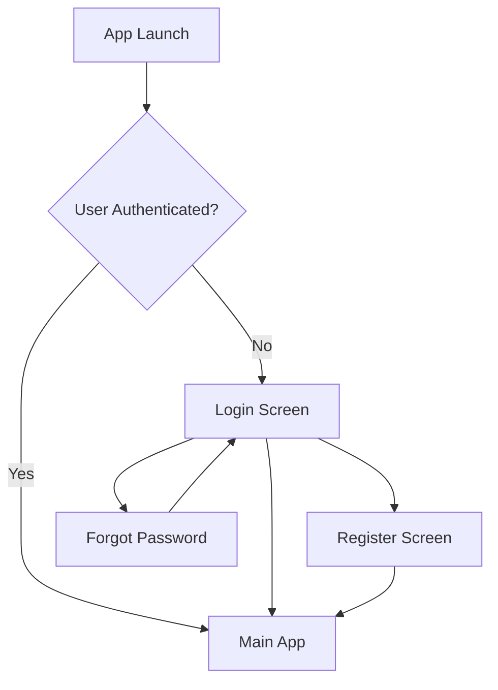
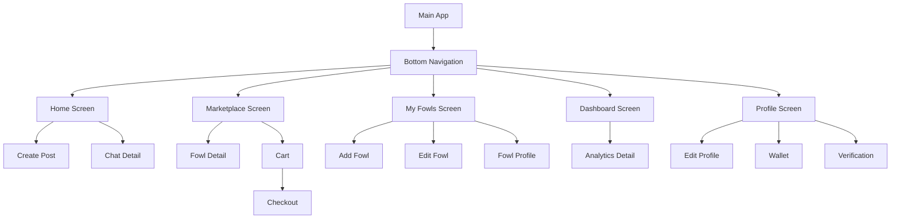
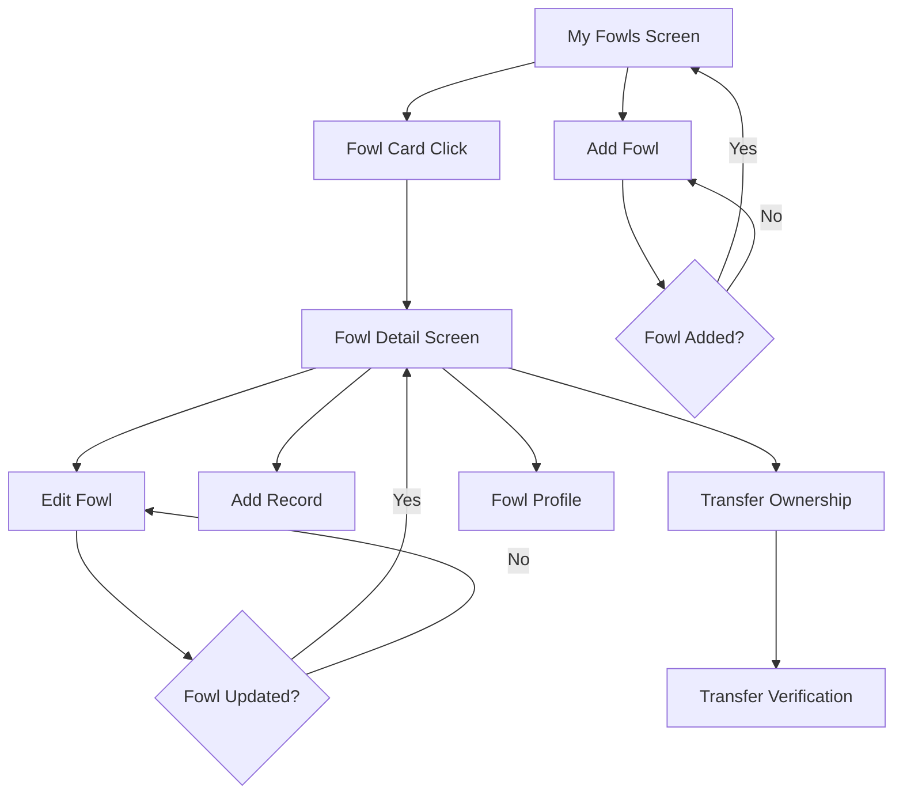
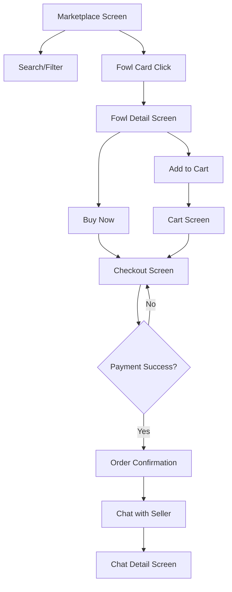
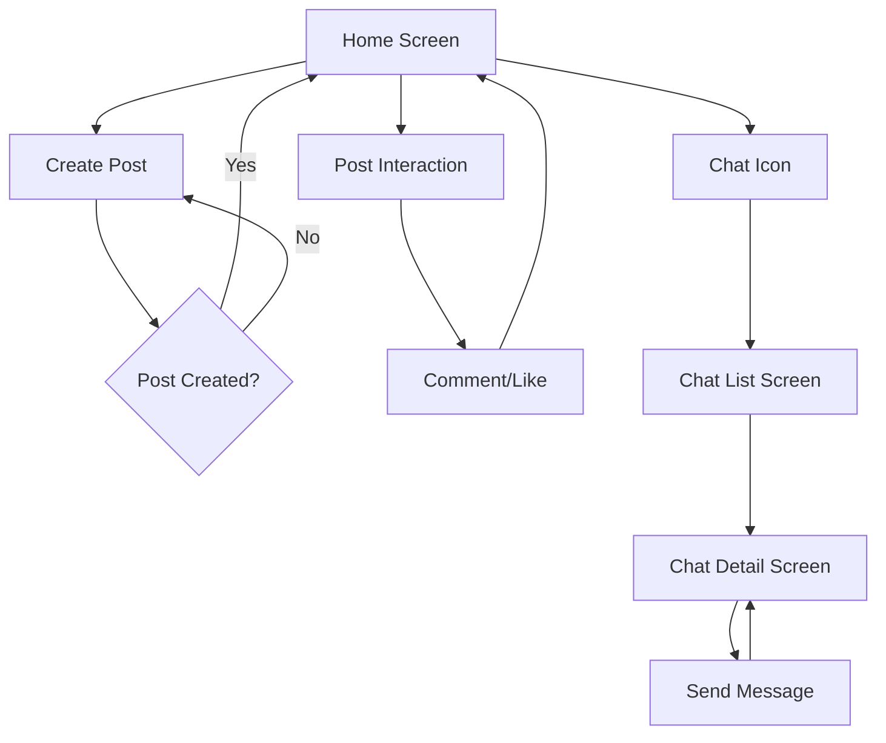

# ROSTRY Navigation Flow Documentation

> **Version**: 1.0.0  
> **Last Updated**: 2025-01-08  
> **Navigation Framework**: Navigation Compose  

## 📋 Overview

ROSTRY uses Jetpack Navigation Compose for type-safe navigation between screens. This document outlines the complete navigation architecture, screen relationships, and user journey flows.

## 🗺️ Navigation Architecture

### Navigation Graph Structure
```kotlin
sealed class Screen(val route: String) {
    // Authentication Flow
    object Login : Screen("login")
    object Register : Screen("register")
    object ForgotPassword : Screen("forgot_password")
    
    // Main Application Flow
    object Home : Screen("home")
    object Dashboard : Screen("dashboard")
    object Marketplace : Screen("marketplace")
    object MyFowls : Screen("my_fowls")
    object Profile : Screen("profile")
    object Chat : Screen("chat")
    
    // Detail Screens with Parameters
    object FowlDetail : Screen("fowl_detail/{fowlId}") {
        fun createRoute(fowlId: String) = "fowl_detail/$fowlId"
    }
    object EditFowl : Screen("edit_fowl/{fowlId}") {
        fun createRoute(fowlId: String) = "edit_fowl/$fowlId"
    }
    object TransferOwnership : Screen("transfer_ownership/{fowlId}/{fowlName}") {
        fun createRoute(fowlId: String, fowlName: String) = "transfer_ownership/$fowlId/$fowlName"
    }
    object ChatDetail : Screen("chat_detail/{chatId}") {
        fun createRoute(chatId: String) = "chat_detail/$chatId"
    }
    object Checkout : Screen("checkout/{fowlId}/{quantity}") {
        fun createRoute(fowlId: String, quantity: Int) = "checkout/$fowlId/$quantity"
    }
    
    // Additional Screens
    object AddFowl : Screen("add_fowl")
    object EditProfile : Screen("edit_profile")
    object Cart : Screen("cart")
    object CreatePost : Screen("create_post")
    object Verification : Screen("verification")
    object Wallet : Screen("wallet")
    object Showcase : Screen("showcase")
}
```

## 🔄 User Journey Flows

### 1. Authentication Flow


**Navigation Implementation:**
```kotlin
// Authentication check on app start
LaunchedEffect(Unit) {
    isLoading = true
    delay(1000) // Simulate loading
    isAuthenticated = FirebaseAuth.getInstance().currentUser != null
    isLoading = false
}

if (isLoading) {
    // Show loading screen
} else if (isAuthenticated) {
    MainAppNavigation(navController)
} else {
    AuthNavigation(navController)
}
```

### 2. Main Application Flow


### 3. Fowl Management Flow


### 4. Marketplace Flow


### 5. Social & Communication Flow


## 🎯 Screen Specifications

### Bottom Navigation Screens

#### 1. Home Screen
- **Route**: `"home"`
- **Purpose**: Social feed and community interaction
- **Navigation Options**:
  - Create Post → `"create_post"`
  - Chat → `"chat"`
  - Dashboard → `"dashboard"`

#### 2. Marketplace Screen
- **Route**: `"marketplace"`
- **Purpose**: Browse and purchase fowls
- **Navigation Options**:
  - Fowl Detail → `"fowl_detail/{fowlId}"`
  - Cart → `"cart"`
  - Chat → `"chat"`

#### 3. My Fowls Screen
- **Route**: `"my_fowls"`
- **Purpose**: Manage user's fowl collection
- **Navigation Options**:
  - Add Fowl → `"add_fowl"`
  - Fowl Detail → `"fowl_detail/{fowlId}"`
  - Edit Fowl → `"edit_fowl/{fowlId}"`

#### 4. Dashboard Screen
- **Route**: `"dashboard"`
- **Purpose**: Analytics and flock overview
- **Navigation Options**:
  - Fowl Detail → `"fowl_detail/{fowlId}"`
  - Add Fowl → `"add_fowl"`

#### 5. Profile Screen
- **Route**: `"profile"`
- **Purpose**: User profile and settings
- **Navigation Options**:
  - Edit Profile → `"edit_profile"`
  - Wallet → `"wallet"`
  - Verification → `"verification"`
  - Showcase → `"showcase"`

### Detail Screens

#### Fowl Detail Screen
- **Route**: `"fowl_detail/{fowlId}"`
- **Parameters**: `fowlId: String`
- **Purpose**: Display comprehensive fowl information
- **Navigation Options**:
  - Edit Fowl → `"edit_fowl/{fowlId}"`
  - Add Record → `"add_record/{fowlId}"`
  - Transfer Ownership → `"transfer_ownership/{fowlId}/{fowlName}"`
  - Fowl Profile → `"fowl_profile/{fowlId}"`
  - Checkout → `"checkout/{fowlId}/{quantity}"`

#### Chat Detail Screen
- **Route**: `"chat_detail/{chatId}"`
- **Parameters**: `chatId: String`
- **Purpose**: Real-time messaging interface
- **Navigation Options**:
  - Back to Chat List
  - User Profile (via participant click)

#### Transfer Ownership Screen
- **Route**: `"transfer_ownership/{fowlId}/{fowlName}"`
- **Parameters**: `fowlId: String, fowlName: String`
- **Purpose**: Initiate fowl ownership transfer
- **Navigation Options**:
  - Transfer Verification → `"transfer_verification/{transferId}"`

## 🔧 Navigation Implementation

### Navigation Host Setup
```kotlin
@Composable
fun RostryNavigation(
    navController: NavHostController,
    startDestination: String
) {
    NavHost(
        navController = navController,
        startDestination = startDestination
    ) {
        // Authentication Graph
        composable(Screen.Login.route) {
            LoginScreen(
                onNavigateToRegister = {
                    navController.navigate(Screen.Register.route)
                },
                onNavigateToForgotPassword = {
                    navController.navigate(Screen.ForgotPassword.route)
                },
                onLoginSuccess = {
                    navController.navigate(Screen.Home.route) {
                        popUpTo(Screen.Login.route) { inclusive = true }
                    }
                }
            )
        }
        
        // Main App Graph
        composable(Screen.Home.route) {
            HomeScreen(
                onNavigateToCreatePost = {
                    navController.navigate(Screen.CreatePost.route)
                },
                onNavigateToChat = {
                    navController.navigate(Screen.Chat.route)
                }
            )
        }
        
        // Parameterized Routes
        composable(
            route = Screen.FowlDetail.route,
            arguments = listOf(navArgument("fowlId") { type = NavType.StringType })
        ) { backStackEntry ->
            val fowlId = backStackEntry.arguments?.getString("fowlId") ?: ""
            FowlDetailScreen(
                fowlId = fowlId,
                onNavigateToEdit = { id ->
                    navController.navigate(Screen.EditFowl.createRoute(id))
                },
                onNavigateBack = {
                    navController.popBackStack()
                }
            )
        }
    }
}
```

### Bottom Navigation Implementation
```kotlin
@Composable
fun BottomNavigationBar(
    navController: NavHostController,
    currentDestination: NavDestination?
) {
    NavigationBar {
        bottomNavItems.forEach { item ->
            NavigationBarItem(
                icon = { Icon(item.icon, contentDescription = item.label) },
                label = { Text(item.label) },
                selected = currentDestination?.hierarchy?.any { 
                    it.route == item.route 
                } == true,
                onClick = {
                    navController.navigate(item.route) {
                        popUpTo(navController.graph.findStartDestination().id) {
                            saveState = true
                        }
                        launchSingleTop = true
                        restoreState = true
                    }
                }
            )
        }
    }
}
```

### Deep Link Support
```kotlin
// Deep link configuration in AndroidManifest.xml
<activity
    android:name=".MainActivity"
    android:exported="true">
    <intent-filter android:autoVerify="true">
        <action android:name="android.intent.action.VIEW" />
        <category android:name="android.intent.category.DEFAULT" />
        <category android:name="android.intent.category.BROWSABLE" />
        <data android:scheme="https"
              android:host="rostry.com" />
    </intent-filter>
</activity>

// Deep link handling in Navigation
composable(
    route = "fowl/{fowlId}",
    deepLinks = listOf(navDeepLink { 
        uriPattern = "https://rostry.com/fowl/{fowlId}" 
    })
) { backStackEntry ->
    // Handle deep link navigation
}
```

## 📱 Navigation Patterns

### Back Stack Management
```kotlin
// Clear back stack when navigating to main screen
navController.navigate(Screen.Home.route) {
    popUpTo(Screen.Login.route) { inclusive = true }
}

// Save and restore state for bottom navigation
navController.navigate(item.route) {
    popUpTo(navController.graph.findStartDestination().id) {
        saveState = true
    }
    launchSingleTop = true
    restoreState = true
}
```

### Conditional Navigation
```kotlin
// Navigate based on user state
if (user.isVerified) {
    navController.navigate(Screen.Marketplace.route)
} else {
    navController.navigate(Screen.Verification.route)
}

// Navigate with result handling
navController.navigate(Screen.AddFowl.route)
navController.currentBackStackEntry
    ?.savedStateHandle
    ?.getLiveData<Boolean>("fowl_added")
    ?.observe(lifecycleOwner) { fowlAdded ->
        if (fowlAdded) {
            // Refresh fowl list
        }
    }
```

### Error Handling
```kotlin
// Handle navigation errors
try {
    navController.navigate(destination)
} catch (e: IllegalArgumentException) {
    // Handle invalid route
    Log.e("Navigation", "Invalid route: $destination", e)
    navController.navigate(Screen.Home.route)
}
```

## 🎨 Navigation UI Components

### Custom Navigation Components
```kotlin
@Composable
fun NavigationTopBar(
    title: String,
    canNavigateBack: Boolean,
    onNavigateBack: () -> Unit = {},
    actions: @Composable RowScope.() -> Unit = {}
) {
    TopAppBar(
        title = { Text(title) },
        navigationIcon = {
            if (canNavigateBack) {
                IconButton(onClick = onNavigateBack) {
                    Icon(Icons.Default.ArrowBack, contentDescription = "Back")
                }
            }
        },
        actions = actions
    )
}
```

### Navigation State Management
```kotlin
@Composable
fun rememberNavigationState(): NavigationState {
    val navController = rememberNavController()
    val currentBackStackEntry by navController.currentBackStackEntryAsState()
    
    return remember(navController, currentBackStackEntry) {
        NavigationState(
            navController = navController,
            currentDestination = currentBackStackEntry?.destination
        )
    }
}
```

---

**This navigation flow documentation provides a comprehensive guide to ROSTRY's navigation architecture and should be used as the reference for implementing navigation features.**
